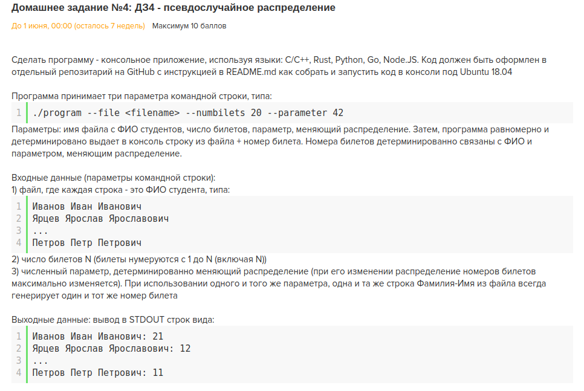

# tp_crypt  

**Выполнил:** Романов Андрей  
**Запуск:** go run program --file <filename> --numbilets 20 --parameter 42  
или ./program --file <filename> --numbilets 20 --parameter 42  
бинарь лежит в репозитории  
